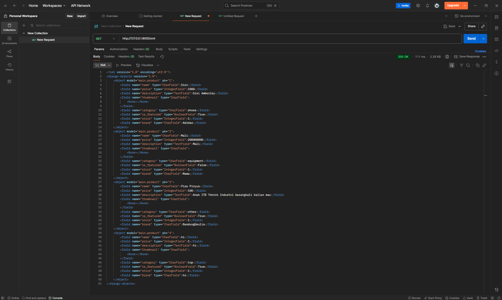
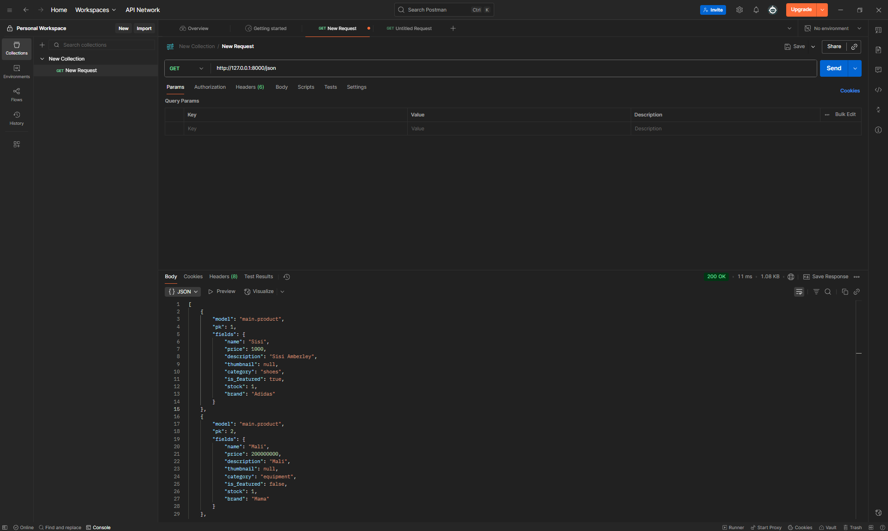
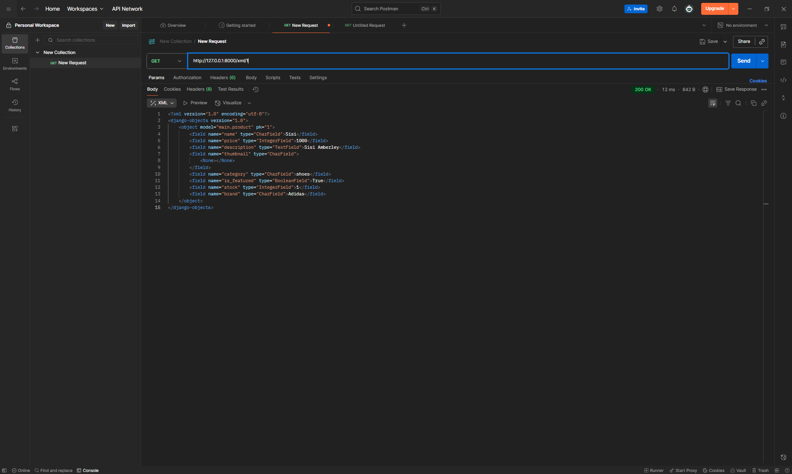
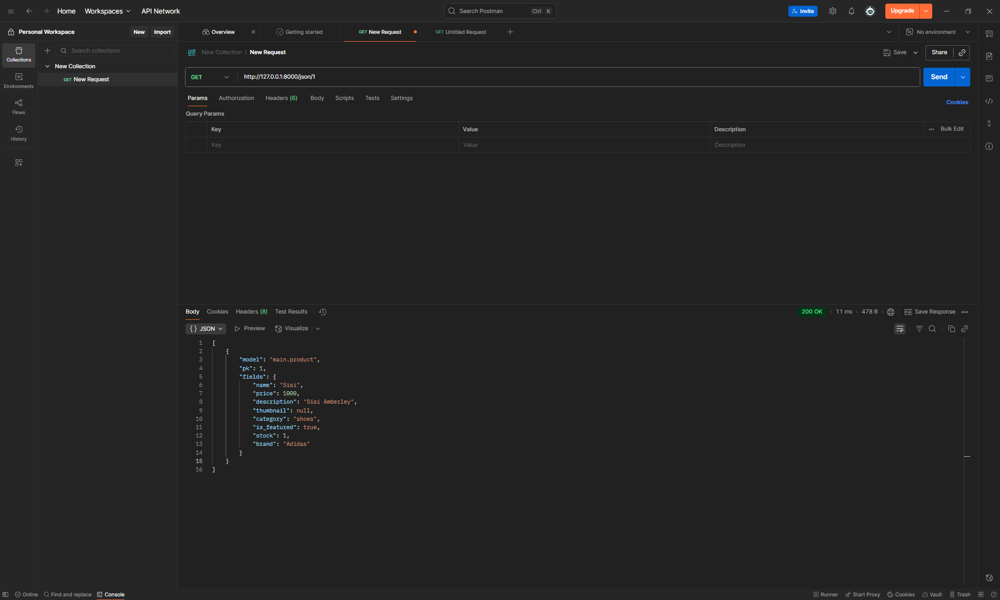

# Tugas 2 PBP: Garuda Gear

Nama : Lessyarta Kamali Sopamena Pirade

NPM : 2406356643

Kelas : PBP C

Penjelasan shop: Garuda Gear adalah platform yang menawarkan perlengkapan sepak bola yang sepenuhnya diproduksi dan dibuat di Indonesia.

Link PWS: https://lessyarta-kamali-garudagear.pbp.cs.ui.ac.id

Pertanyaan Tugas 2:

1. Jelaskan bagaimana cara kamu mengimplementasikan checklist di atas secara step-by-step (bukan hanya sekadar mengikuti tutorial).

   Langkah-langkah pengerjaan sesuai checklist:
   Langkah 1: Membuat sebuah proyek Django baru.
   Membuat direktori garuda-gear, lalu membuat virtual environment dan mengaktifkannya. Setelah itu, saya menyiapkan dependencies di requirements.txt dan menginstallnya.
   Buat proyek Django bernama garuda_gear.
   Konfigurasi environtment variables dengan membuat .env dan .env.prod. Di dalam file .env, atur PRODUCTION=False agar aplikasi menggunakan database SQLite yang simpel untuk pengerjaan pada laptop saya. Di dalam .env.prod ada PRODUCTION=True dan kredensial saya agar dapat berjalan di PWS saat online.
   Lalu, saya modifikasi settings.py agar dapat membaca environment variables dari file .env.
   Melakukan migrasi database dan run server. Memeriksa aplikasi di http://localhost:8000 pada browser.

   Langkah 2: Membuat aplikasi dengan nama main pada proyek tersebut, membuat model pada aplikasi main, membuat fungsi pada views.py, membuat routing pada urls.py.
   Setelah membuat proyek baru, saya membuat aplikasi main yang terdiri dari model untuk struktur database, view untuk logika, dan template untuk tampilan. Saya mendaftarkan aplikasi main di dalam file settings.py agar diakui oleh proyek, lalu memasukkan nama aplikasi, nama pembuat, dan kelas di views.py agar dapat digunakan pada main.html dengan placeholder {{...}}. Kemudian, saya melakukan routing dua tingkat di urls.py, baik di level proyek, maupun di level aplikasi.

   Langkah 3: Melakukan deployment ke PWS terhadap aplikasi yang sudah dibuat sehingga nantinya dapat diakses oleh teman-temanmu melalui Internet.
   Saya melakukan direct push, namun gagal pada awalnya. Ketika saya periksa di log build, kegagalan ini ternyata diakibatkan oleh tidak ditemukannya file requirements.txt. Saya kemudian melakukan pip freeze lalu add file requirements.txt kembali. Setelah itu, deployment ke PWS sukses dan dapat diakses di https://lessyarta-kamali-garudagear.pbp.cs.ui.ac.id/

2. Buatlah bagan yang berisi request client ke web aplikasi berbasis Django beserta responnya dan jelaskan pada bagan tersebut kaitan antara urls.py, views.py, models.py, dan berkas html.

   Bagan: https://drive.google.com/file/d/14AcmpOH011RIrVKUiDqXNh1vQHa-Nrzh/view?usp=sharing

   Saat sebuah permintaan dari klien diterima, Django akan memeriksanya terlebih dahulu di urls.py level proyek. Jika pola URL cocok dan mengarah ke aplikasi main, permintaan akan diteruskan untuk diproses lebih lanjut oleh urls.py di level aplikasi. Di sini, pola URL yang lebih spesifik akan dicocokkan untuk menjalankan fungsi view yang dituju. Namun, jika tidak ada pola yang cocok sejak awal di level proyek, Django akan langsung mengembalikan respons 404 Not Found.

3. Jelaskan peran settings.py dalam proyek Django!

   Dalam proyek Django, settings.py berfungsi sebagai pusat konfigurasi utama dari sebuah aplikasi.

   Sesuai dengan yang saya lakukan dalam pembuatan Tugas 2 PBP ini, perannya sebagai berikut:

   - Menambahkan 'main' ke daftar INSTALLED_APPS agar proyek Django mengenali dan mengelola aplikasi main yang sudah saya buat.
   - Mengatur database agar aplikasi bisa secara cerdas beralih antara menggunakan database SQLite saat pengembangan di laptop saya, dan menggunakan database PostgreSQL saat di-deploy ke PWS dengan cara membaca environment variables.
   - File settings.py menyimpan SECRET_KEY unik proyek saya dan ALLOWED_HOSTS, yaitu daftar domain yang diizinkan untuk mengakses aplikasi saya.

4. Bagaimana cara kerja migrasi database di Django?

   Migrasi adalah cara memastikan database proyek yang sedang dibuat selalu cocok dengan rancangan yang saya tulis di file models.py. Pertama menjalankan perintah makemigrations di mana Django akan melihat perubahan yang baru dibuat pada model dan secara otomatis membuat sebuah file "rencana kerja". Kemudian, saat menjalankan migrate di mana Django akan membaca "rencana kerja" tersebut dan membangun atau mengubah tabel Product di dalam database. Setiap kali ada perubahan di models.py, migrasi harus dilakukan.

5. Menurut Anda, dari semua framework yang ada, mengapa framework Django dijadikan permulaan pembelajaran pengembangan perangkat lunak?

   Menurut saya, Django baik untuk pemula karena menyediakan banyak fitur penting secara bawaan sehingga tidak akan sulit untuk memilih library tambahan. Contohnya, fitur ORM (Object-Relational Mapper) memungkinkan interaksi dengan database menggunakan Python tanpa perlu menulis SQL, dan Admin Panel yang dibuat secara otomatis memberikan antarmuka siap pakai untuk mengelola data secara visual. Selain itu, strukturnya dengan pola Model-View-Template (MVT) juga memudahkan pemula untuk menulis kode yang rapi dan memisahkan antara logika, data, dan tampilan.

6. Apakah ada feedback untuk asisten dosen tutorial 1 yang telah kamu kerjakan sebelumnya?

   Tutorial 1 sangat membantu dan mudah dimengerti. Terima kasih banyak tim asisten dosen!

Pertanyaan Tugas 3:

1. Jelaskan mengapa kita memerlukan data delivery dalam pengimplementasian sebuah platform?
   Data delivery sangat penting karena sebuah platform dinamis perlu mengirimkan data dari satu stack ke stack lainnya. Dalam kasus Garuda Gear, ini berarti mengirimkan data dari backend (server Django dan database) ke frontend (browser pengguna). Tanpa data delivery, Garuda Gear yang saya bangun hanya akan menjadi halaman HTML statis.
   Dengan data delivery, garuda gear dapat:
   1) Menampilkan katalog produk yang dijual, di mana saya menggunakan data delivery dalam format HTML untuk mengirimkan daftar produk dari database ke template main.html.
   2) Menyediakan data untuk platform lain, di mana saya  mengimplementasikan endpoint yang mengembalikan data dalam format XML dan JSON.

2. Menurutmu, mana yang lebih baik antara XML dan JSON? Mengapa JSON lebih populer dibandingkan XML?
   Menurut saya, JSON lebih baik dan lebih modern untuk pengembangan web. Hal ini karena tampilan data di JSON lebih ringkas dan mudah saya baca. JSON lebih populer dibandingkan XML. Hal ini karena meskipun sintaks JSON berasal dari objek JavaScript dan JavaScript adalah bahasa dominan untuk frontend web. Hal ini membuat proses pengolahan data JSON di browser menjadi lebih natural. XML juga memerlukan proses parsing yang lebih rumit.

3. Jelaskan fungsi dari method is_valid() pada form Django dan mengapa kita membutuhkan method tersebut?
   Method is_valid() berfungsi sebagai lapisan validasi data. Sebelum data yang dikirim pengguna dari form diizinkan untuk disimpan ke database, method is_valid() akan memeriksa apakah semua input sesuai dengan aturan yang ada di ProductForm dan Product model.
   Misalnya, semua field wajib sudah terisi dan semua tipe data sudah benar.

4. Mengapa kita membutuhkan csrf_token saat membuat form di Django? Apa yang dapat terjadi jika kita tidak menambahkan csrf_token pada form Django? Bagaimana hal tersebut dapat 
dimanfaatkan oleh penyerang?
   csrf_token adalah token yang berfungsi sebagai security. Token ini di-generate secara otomatis oleh Django untuk mencegah serangan berbahaya. 
   Jika saya tidak menambahkan csrf_token pada form tambah produk di Garuda Gear, maka form saya akan rentan terhadap serangan Cross-Site Request Forgery (CSRF). 
   Skenario yang dapat dimanfaatkan oleh penyerang:
   1) Saya login ke aplikasi Garuda Gear.
   2) Saya mengunjungi website lain yang sudah dimasuki penyerang.
   3) Webite tersebut memiliki kode yang secara diam-diam mengirimkan request POST ke URL tambah produk di aplikasi saya.
   4) Karena saya masih login, request jahat tersebut akan membawa cookie sesi saya yang valid.
   5) Tanpa csrf_token, server saya akan menganggap request tersebut sah dan akan memprosesnya (misalnya, menambahkan produk spam ke katalog saya) tanpa saya sadari.
   Jika saya mempunyai csrf_token, setiap request POST dari browser pengguna harus menyertakan token unik yang cocok dengan yang ada di server. Penyerang tidak akan memiliki token ini, sehingga request dari penyerang akan ditolak dan serangan gagal.

5. Jelaskan bagaimana cara kamu mengimplementasikan checklist di atas secara step-by-step (bukan hanya sekadar mengikuti tutorial).
   
   Pertama, saya menyiapkan 4 fungsi baru di views.py, yaitu def show_xml(request), def show_json(request), def show_xml_by_id(request, news_id), dan def show_json_by_id(request, news_id).
   Lalu saya memperbaiki bagian class Product dan category product dengan membuat class Product dengan field-field yang diperlukan: name, price, description, thumbnail, category, is_featured, stock, brand, dan menggunakan CATEGORY_CHOICES untuk memberikan pilihan kategori produk
   Setelah itu saya membuat class ProductForm yang inherit dari ModelForm.

   Saya menambahkan 2 file html baru:
   1) Template add_product.html yang menyediakan tombol submit untuk menambahkan produk
   2) Template product_detail.html yang bekerja untuk menampilkan detail lengkap produk termasuk nama, kategori, brand, stok, dan status bestseller, menampilkan gambar produk jika tersedia dan menampilkan tombol back untuk kembali ke daftar produk
   
   Kemudian, saya membuat fungsi add_product(request) di views.py yang jika valid akan menyimpan data ke database dan redirect ke halaman utama.
   Saya juga membuat fungsi show_product(request, id) di views.py untuk menangani kasus produk tidak ditemukan dengan mengembalikan 404 dan mengirim data produk ke template product_detail.html
   
   Lalu, menambahkan 4 fungsi views baru di views.py, yaitu def show_xml(request) yang mengkonversi data ke format XML, def show_json(request) yang mengkonversi data ke format JSON, def show_xml_by_id(request, news_id) yang mengambil produk berdasarkan ID dan mengkonversi hasil ke format XML, serta def show_json_by_id(request, news_id) yang mengambil satu produk berdasarkan ID dan mengkonversi hasil ke format JSON dan mengembalikan HttpResponse.
   
   Saya juga membuat URL routing dengan menambahkan URL patterns di urls.py.
   Setelah implementasi selesai, saya melakukan testing untuk melihat semua produk dalam format XML dan JSON, serta melihat produk tertentu dalam format XML dan JSON

6. Apakah ada feedback untuk asdos di tutorial 2 yang sudah kalian kerjakan?
   Tutorial 2 sangat jelas dan membantu dalam Tugas 3 PBP ini. Terima kasih banyak tim asisten dosen!

Screenshot Postman:

